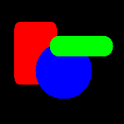

# banglejs-2-fillroundrect #

fills a rounded rectangle on a Bangle.js 2

This module adds a method `fillroundrect` for drawing filled rounded rectangles to the global graphics context `g`. The current implementation is based on a remark from forum user [RaoulDuke](http://forum.espruino.com/profiles/181747/) (see [this discussion](http://forum.espruino.com/conversations/371330)).



The new method has the signature

```javascript
g.fillroundrect(x1,y1, x2,y2, radius);
```

with the following parameters:

* `x1` - the left x coordinate
* `y1` - the top y coordinate
* `x2` - the right x coordinate
* `y2` - the bottom y coordinate
* `radius` - the corner radius (limited to 50% of the shorter edge of the rectangle

The rounded rectangle is drawn and filled with current foreground color.

## License ##

[MIT License](LICENSE.md)
